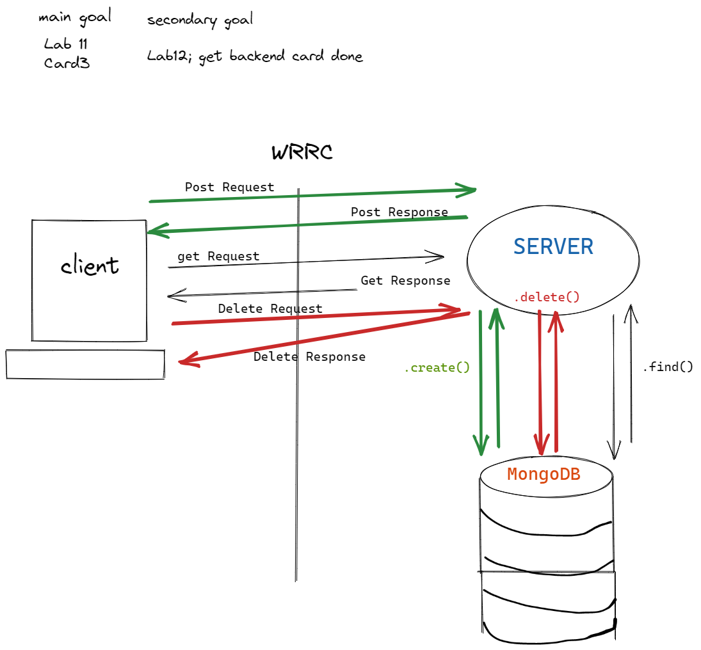

# Can Of Books

**Author**: Hambalieu Jallow, Kevin LaMarca
**Version**: 1.0.0 

## Overview
Creating an Online Bookstore Application  

## Work flow

## Card 1
- Configured a new repository for our Back end Application
- Added an empty dotenv file   
- Added a dev branch   

## Card 2
- connected mongoose 
- Saved data into MongoDb  
- Created a `/books` route.We  Use a REST client to hit the route, so we can continually verify what your server is returning. 
- When a client sends a `GET` to the `/books` route, our server  retrieves all of the books belonging to requesting user from the books database, and return them as JSON in the response object.  

## CARD 3
- In the `BestBooks` component, make a `GET` request to your server `/books` route, in the `componentDidMount` function.  
- Store the book data returned from the server in the application `state`.  
- Use conditional logic to only render the books when there are more than 0 books stored in the application state.  
- When the server does return some books, use a Bootstrap carousel to render all the books returned.  
- When the server returns no books then render a message that the book collection is empty.  
- Use React Router to add ability for user to navigate between Profile and Home "pages".  

## Lab 12 POST AND DELETE

###  POST   
- Add a new route and handler function to your server, to respond to `POST` requests to `/books`. This is your book-creation end point. Verify it's working by sending a raw POST request via your REST Client.

- Grab the email address of the current user, along with the properties of the book to be created. Create an object-literal representation of a Book with these book property values. Verify the server is doing this correctly with your REST Client.

- Add your new book object to the database. Respond to the request with the newly-saved book. With your REST Client, verify that this is working.

- added server error message

### DELETE   

- dd a server end point to handle `DELETE` requests to `/books/:id`.   

- Verify that you can access the book id from the `request.params` object, and the user's email from the `request.query` object.  

- Use the id of the book to delete that book, as long as the email addresses of user and book match.  

- If all goes well, send back a success response. Handle any errors with proper error messages and response status codes.  

## Lab 13 PUT

- added functionality for PUT request and update MongoDB database objects..

Name of feature: _____________ lab 12 post and delete __________________

Estimate of time needed to complete: ___1_

Start time: ____6:00_pm

Finish time: ____7:00pm_

Actual time needed to complete: ___1 hours_

[TrelloBoard](https://trello.com/c/wI5I32vV/7-2-storage-as-a-user-id-like-my-books-to-persist-so-that-whenever-i-make-changes-i-can-see-the-my-full-list-of-best-books)

[TeamRule](https://docs.google.com/document/d/1RVJ2PoBzTdljn1Gm_S-nQU3y0B3QqDhNXiDn-QOIc2g/edit#heading=h.mx1b8tz44qrp)

## 1/26 lab 13

Name of feature: implemented post, delete, put routes 

Estimate of time needed to complete: 4 hours

Start time: ____3_pm

Finish time: ____700 pm_

Actual time needed to complete: ___4 1/2 hours_
